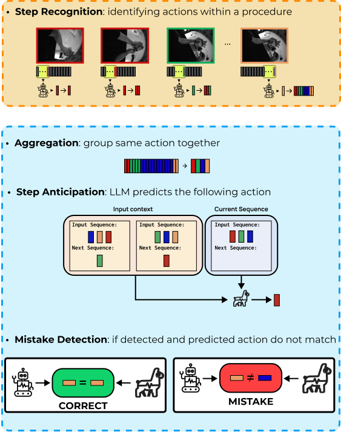

# PREGO: online mistake detection in PRocedural EGOcentric videos (CVPR '24)

### [[Project Page]](https://www.pinlab.org/prego) [[Paper]](https://openaccess.thecvf.com/content/CVPR2024/html/Flaborea_PREGO_Online_Mistake_Detection_in_PRocedural_EGOcentric_Videos_CVPR_2024_paper.html)

The official PyTorch implementation of the IEEE/CVF Computer Vision and Pattern Recognition (CVPR) '24 paper **PREGO: online mistake detection in PRocedural EGOcentric videos**.

### 🚧 REPO UNDER CONSTRUCTION

PREGO is the first online one-class classification model for mistake detection in procedural egocentric videos. It uses an online action recognition component to model current actions and a symbolic reasoning module to predict next actions, detecting mistakes by comparing the recognized current action with the expected future one. We evaluate this on two adapted datasets, Assembly101-O and Epic-tent-O, for online benchmarking of procedural mistake detection.



## News

 **[2024-06-16]** Uploaded the anticipation branch.

<!-- ## Data -->
<!-- *WIP* -->

## Usage

### Anticipation
```bash
./scripts/anticipation.sh
```

## Reference
If you find our code or paper to be helpful, please consider citing:
```
@InProceedings{Flaborea_2024_CVPR,
    author    = {Flaborea, Alessandro and di Melendugno, Guido Maria D'Amely and Plini, Leonardo and Scofano, Luca and De Matteis, Edoardo and Furnari, Antonino and Farinella, Giovanni Maria and Galasso, Fabio},
    title     = {PREGO: Online Mistake Detection in PRocedural EGOcentric Videos},
    booktitle = {Proceedings of the IEEE/CVF Conference on Computer Vision and Pattern Recognition (CVPR)},
    month     = {June},
    year      = {2024},
    pages     = {18483-18492}
}
```
